# AiChat UI - 个人简洁的博客平台

<div align="center">


[](https://opensource.org/licenses/Apache-2.0)
[](https://www.php.net/)
[](https://vuejs.org/)
[](https://www.thinkphp.cn/)
[](https://element-plus.org/)

**一个现代化的个人简洁的博客平台，基于ThinkPHP 8和Vue.js 3构建**

</div>

## ✨ 特性

- 🚀 **现代化技术栈**: 基于 ThinkPHP 8 + Vue.js 3 + Element Plus
- 🎨 **响应式设计**: 支持桌面端和移动端，自适应各种屏幕尺寸
- 🌍 **国际化支持**: 内置中英文双语支持，易于扩展其他语言
- 🔐 **安全可靠**: JWT认证、RBAC权限控制、SQL注入防护
- ⚡ **高性能**: Redis缓存、数据库优化、前端代码分割
- 🛠️ **AI工具管理**: 完整的AI工具收录、分类、评价系统
- 👥 **用户系统**: 用户注册登录、个人中心、收藏点赞
- 📊 **数据统计**: 详细的访问统计和用户行为分析
- 🎯 **SEO优化**: 友好的URL结构、meta标签优化
- 📱 **PWA支持**: 支持离线访问和桌面安装

## 🏗️ 技术栈

### 后端
- **框架**: ThinkPHP 8.x
- **数据库**: MySQL 5.7+ / MariaDB 10.3+
- **缓存**: Redis 6.0+
- **语言**: PHP 8.0+
- **认证**: JWT Token
- **API**: RESTful API

### 前端
- **框架**: Vue.js 3.x
- **UI库**: Element Plus 2.x
- **状态管理**: Pinia
- **路由**: Vue Router 4.x
- **构建工具**: Vite 6.x
- **HTTP客户端**: Axios
- **样式**: Sass/SCSS

### 开发工具
- **包管理**: Composer (后端) + npm (前端)
- **代码规范**: PSR-4 (后端) + ESLint (前端)
- **版本控制**: Git
- **部署**: Docker / 传统部署

## 📁 项目结构

```
aichat-ui/                    #跟目录 命名无所谓
├── app/                    # 后端应用目录
│   ├── api/                # API控制器
│   │   └── controller/     # 控制器文件
│   ├── common/             # 公共类和函数
│   ├── middleware/         # 中间件
│   ├── model/              # 数据模型
│   ├── service/            # 业务服务层
│   └── validate/           # 数据验证器
├── config/                 # 配置文件
├── database/               # 数据库相关
│   ├── migrations/         # 数据库迁移
│   └── seeds/              # 数据填充
├── frontend/               # 前端应用
│   ├── public/             # 静态资源
│   ├── src/                # 源代码
│   │   ├── api/            # API请求封装
│   │   ├── components/     # 公共组件
│   │   ├── views/          # 页面组件
│   │   │   ├── admin/      # 管理后台
│   │   │   ├── index/      # 前台页面
│   │   │   └── user/       # 用户中心
│   │   ├── router/         # 路由配置
│   │   ├── stores/         # 状态管理
│   │   └── utils/          # 工具函数
│   ├── package.json        # 前端依赖
│   └── vite.config.js      # 构建配置
├── public/                 # Web根目录
├── route/                  # 路由配置
├── tools/                  # 开发工具
├── pic/                  # 网站功能截图
├── composer.json           # 后端依赖
└── README.md               # 项目说明
```

## 🚀 核心功能

### 🤖 AI工具管理
- **工具收录**: 支持添加各类AI工具，包括详细信息、分类标签
- **智能分类**: 多级分类体系，支持标签管理和筛选
- **评价系统**: 用户评分、评论、点赞功能
- **收藏功能**: 用户可收藏喜欢的AI工具
- **访问统计**: 详细的工具访问数据和用户行为分析

### 👥 用户系统
- **用户注册/登录**: 支持邮箱、手机号注册
- **个人中心**: 完整的用户资料管理
- **权限控制**: 基于RBAC的角色权限管理
- **活动日志**: 用户操作记录和安全日志

### 📊 管理后台
- **仪表盘**: 数据统计和可视化图表
- **用户管理**: 用户列表、状态管理、权限分配
- **内容管理**: AI工具审核、分类管理、标签管理
- **系统设置**: 网站配置、SEO设置、安全配置
- **日志管理**: 系统日志、操作日志、错误日志

### 🎨 前端特性
- **响应式设计**: 完美适配桌面端和移动端
- **主题切换**: 支持亮色/暗色主题，可跟随系统
- **国际化**: 中英文双语支持，易于扩展
- **组件化**: 高度模块化的Vue组件
- **性能优化**: 代码分割、懒加载、缓存优化

## 📸 功能截图

<details>
<summary>点击查看博客功能截图</summary>


### 🏠 首页展示
展示博客的首页
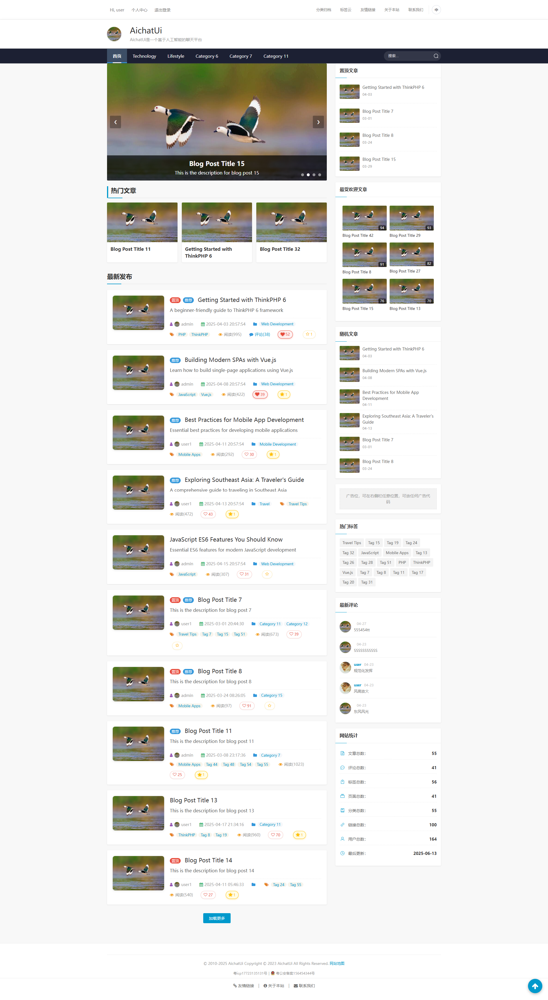

### 🔍 搜索功能
智能搜索和筛选，快速找到需要的分类、文章等
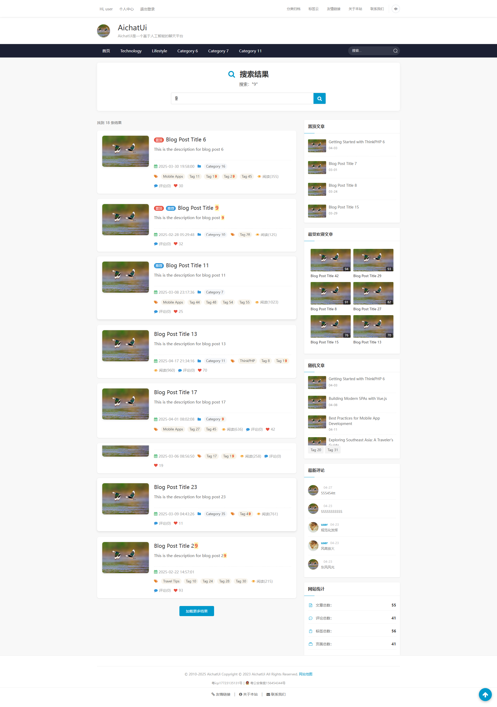

### 📂 分类归档
按分类浏览分类，便于用户查找特定类型
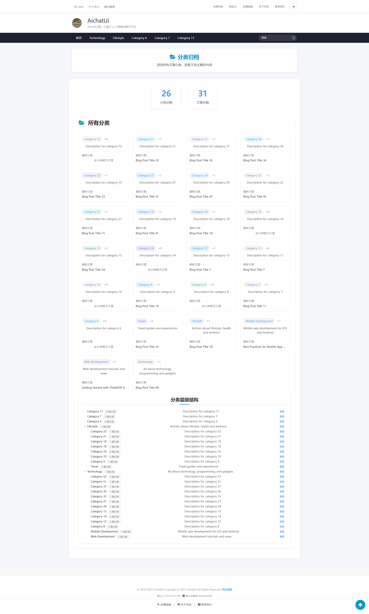

### 🏷️ 标签云
通过标签云快速浏览热门标签
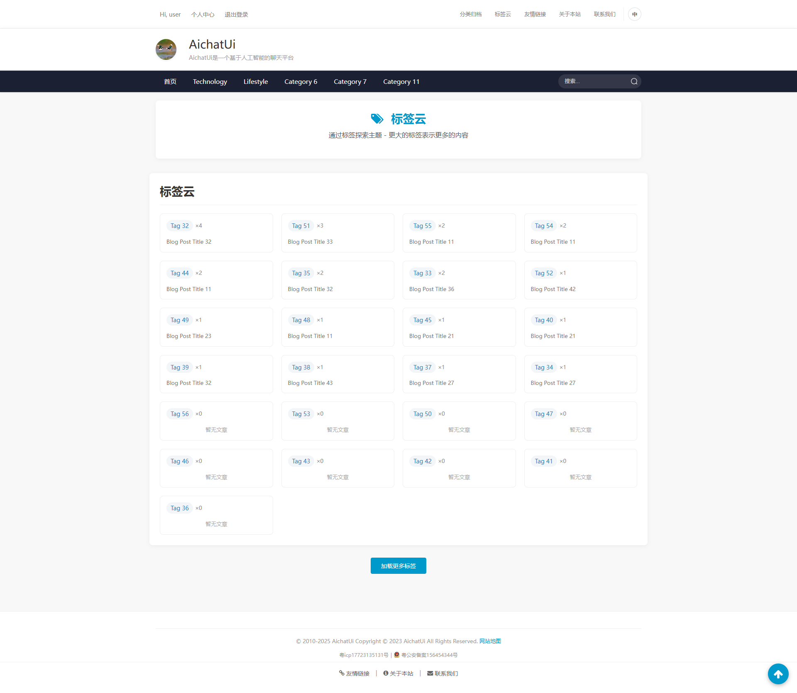

### 📄 文章详情
详细的工具介绍页面，包含完整的信息和用户评价
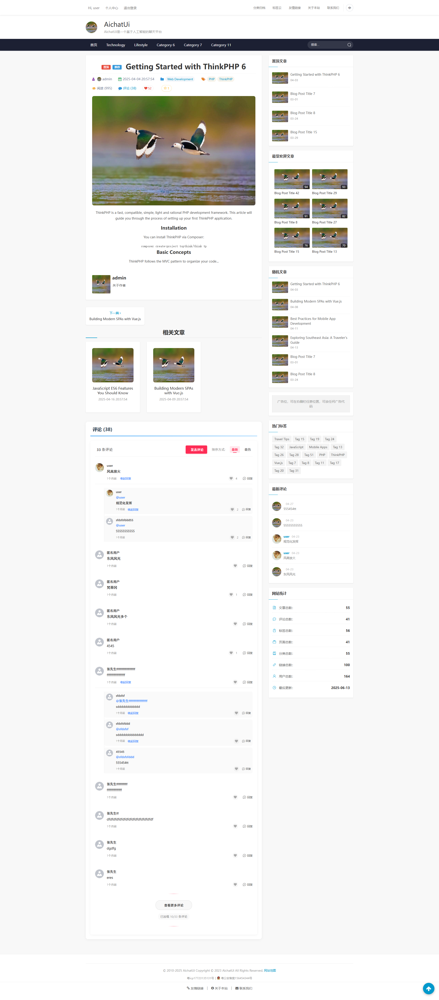

### 👤 个人中心
用户个人资料管理、收藏列表和使用记录
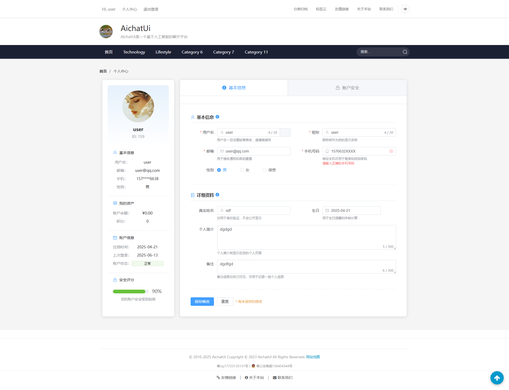

### 🔗 友情链接
合作伙伴和相关资源链接展示
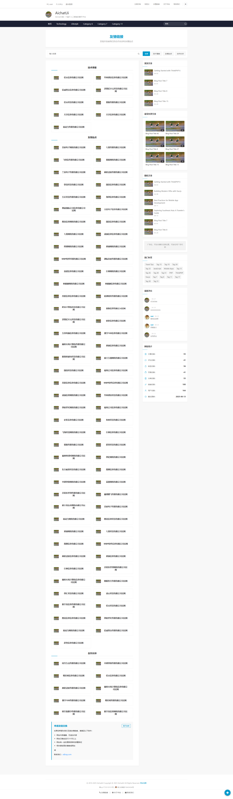

### 📞 联系我们
用户反馈和联系方式页面
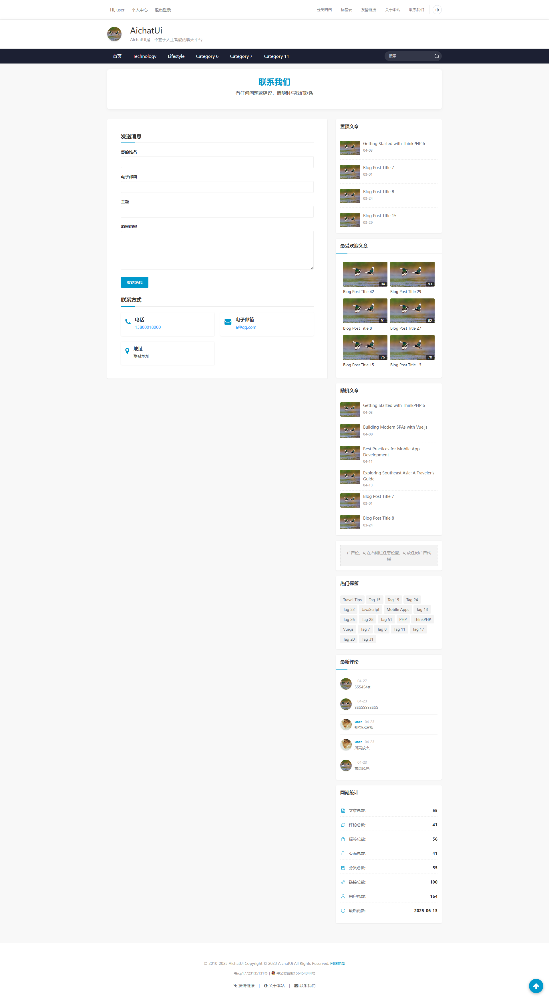

### ℹ️ 关于我们
平台介绍和团队信息展示
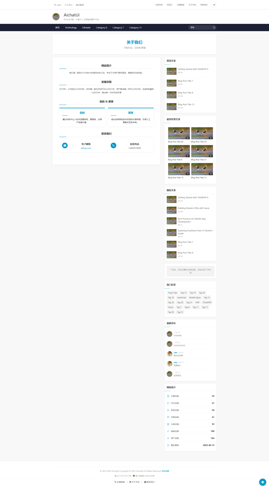

### 🗺️ 网站地图
完整的网站结构导航，帮助用户快速定位内容
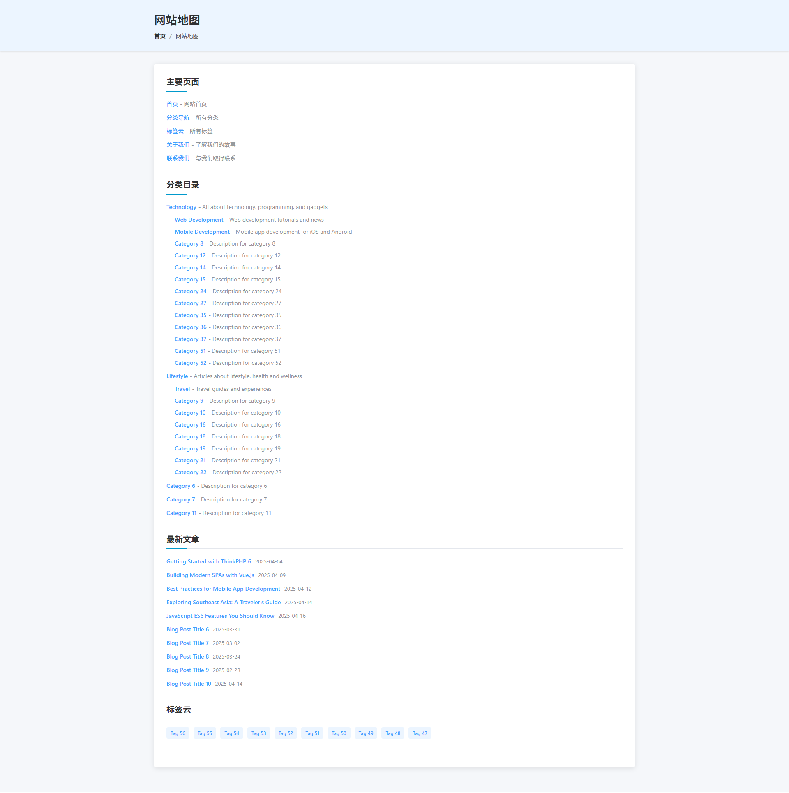

</details>


<details>
<summary>点击查看管理后台功能截图</summary>

### 🗺️ 完整的网站后台结构导航，以及相关导航对应的功能模块
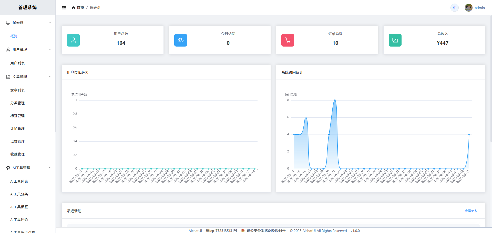

</details>
## 🛠️ 快速开始

### 环境要求

#### 后端环境
- **PHP**: 8.0+ (推荐 8.1+)
- **数据库**: MySQL 5.7+ / MariaDB 10.3+
- **缓存**: Redis 6.0+ (可选，推荐)
- **Web服务器**: Nginx / Apache
- **包管理**: Composer 2.0+

#### 前端环境
- **Node.js**: 16+ (推荐 18+)
- **包管理**: npm / yarn / pnpm

### 🚀 安装部署

#### 1. 克隆项目
```bash
git clone https://github.com/antelydo/blog
cd aichat-ui
```

#### 2. 后端安装
```bash
# 安装PHP依赖
composer install

# 复制环境配置文件
cp .env.example .env

# 编辑配置文件
nano .env
```

**配置示例 (.env)**:
```env
# 应用配置
APP_DEBUG = false
APP_TRACE = false

# 数据库配置
DATABASE_TYPE = mysql
DATABASE_HOSTNAME = 127.0.0.1
DATABASE_DATABASE = aichat_ui
DATABASE_USERNAME = root
DATABASE_PASSWORD = your_password
DATABASE_HOSTPORT = 3306
DATABASE_CHARSET = utf8mb4

# Redis配置 (可选)
CACHE_DRIVER = redis
REDIS_HOST = 127.0.0.1
REDIS_PORT = 6379
REDIS_PASSWORD =
```

#### 3. 数据库初始化
```bash
# 创建数据库
mysql -u root -p -e "CREATE DATABASE aichat_ui CHARACTER SET utf8mb4 COLLATE utf8mb4_unicode_ci;"

# 运行数据库迁移
php think migrate:run

# 填充初始数据 (可选)
php think seed:run
```

#### 4. 前端安装
```bash
cd frontend

# 安装依赖
npm install

# 复制环境配置
cp .env.example .env.local

# 编辑前端配置
nano .env.local
```

**前端配置示例 (.env.local)**:
```env
# API地址
VITE_APP_API_URL = http://localhost:8000

# 应用配置
VITE_APP_TITLE = AiChat UI
VITE_APP_DESCRIPTION = AI工具聚合平台
```

#### 5. 启动开发服务器
```bash
# 启动后端服务 (在项目根目录)
php think run

# 启动前端服务 (在frontend目录)
cd frontend
npm run dev
```

现在您可以访问：
- 前端应用: http://localhost:3000
- 后端API: http://localhost:8000
- 管理后台: http://localhost:3000/admin

## 🚀 生产环境部署

### Docker 部署 (推荐)

#### 1. 使用 Docker Compose
```bash
# 克隆项目
git clone https://github.com/antelydo/blog
cd aichat-ui

# 复制配置文件
cp docker-compose.yml.example docker-compose.yml
cp .env.docker .env

# 启动服务
docker-compose up -d
```

#### 2. Docker Compose 配置示例
```yaml
version: '3.8'
services:
  app:
    build: .
    ports:
      - "80:80"
    volumes:
      - ./storage:/var/www/html/storage
    environment:
      - APP_ENV=production
    depends_on:
      - mysql
      - redis

  mysql:
    image: mysql:8.0
    environment:
      MYSQL_ROOT_PASSWORD: your_password
      MYSQL_DATABASE: aichat_ui
    volumes:
      - mysql_data:/var/lib/mysql

  redis:
    image: redis:7-alpine
    volumes:
      - redis_data:/data

volumes:
  mysql_data:
  redis_data:
```

### 传统部署

#### 1. 服务器要求
- **操作系统**: Ubuntu 20.04+ / CentOS 8+ / Debian 11+
- **Web服务器**: Nginx 1.18+ / Apache 2.4+
- **PHP**: 8.0+ (推荐 8.1+)
- **数据库**: MySQL 8.0+ / MariaDB 10.6+
- **缓存**: Redis 6.0+

#### 2. 后端部署
```bash
# 1. 克隆代码
git clone https://github.com/your-username/aichat-ui.git
cd aichat-ui

# 2. 安装依赖
composer install --no-dev --optimize-autoloader

# 3. 配置环境
cp .env.production .env
nano .env

# 4. 设置权限
chmod -R 755 .
chown -R www-data:www-data .
chmod -R 777 runtime public/storage

# 5. 数据库迁移
php think migrate:run
```

#### 3. 前端构建
```bash
cd frontend

# 安装依赖
npm ci

# 构建生产版本
npm run build

# 将构建文件复制到Web根目录
cp -r dist/* /var/www/html/
```

#### 4. Nginx 配置示例
```nginx
server {
    listen 80;
    server_name your-domain.com;
    root /var/www/html;
    index index.html index.php;

    # 前端路由
    location / {
        try_files $uri $uri/ /index.html;
    }

    # API路由
    location /api {
        try_files $uri $uri/ /index.php?$query_string;
    }

    # PHP处理
    location ~ \.php$ {
        fastcgi_pass unix:/var/run/php/php8.1-fpm.sock;
        fastcgi_index index.php;
        fastcgi_param SCRIPT_FILENAME $document_root$fastcgi_script_name;
        include fastcgi_params;
    }

    # 静态资源缓存
    location ~* \.(js|css|png|jpg|jpeg|gif|ico|svg)$ {
        expires 1y;
        add_header Cache-Control "public, immutable";
    }

    # 安全设置
    location ~ /\. {
        deny all;
    }
}
```

## 📚 API 文档

### 认证方式
所有API请求都需要在请求头中包含认证信息：
```
Authorization: Bearer <your-token>
Content-Type: application/json
```

### 基础响应格式
```json
{
  "code": 200,
  "msg": "success",
  "data": {}
}
```

### 主要API端点

#### 用户相关
- `POST /api/auth/login` - 用户登录
- `POST /api/auth/register` - 用户注册
- `GET /api/user/info` - 获取用户信息
- `PUT /api/user/update` - 更新用户信息

#### AI工具相关
- `GET /api/tool/list` - 获取工具列表
- `GET /api/tool/detail` - 获取工具详情
- `POST /api/toolComment/addToolCom` - 添加工具评论
- `POST /api/toolFavorite/favorite` - 收藏工具

#### 管理后台
- `GET /api/adminAiTool/list` - 管理工具列表
- `POST /api/adminAiTool/create` - 创建工具
- `PUT /api/adminAiTool/update` - 更新工具
- `DELETE /api/adminAiTool/delete` - 删除工具

### 错误码说明
| 错误码 | 说明 |
|--------|------|
| 200 | 成功 |
| 400 | 请求参数错误 |
| 401 | 未授权 |
| 403 | 权限不足 |
| 404 | 资源不存在 |
| 500 | 服务器内部错误 |

详细的API文档请参考：[API Documentation](docs/api.md)

## 🤝 贡献指南

我们欢迎所有形式的贡献！无论是报告bug、提出新功能建议，还是提交代码改进。

### 如何贡献

1. **Fork 项目**
   ```bash
   git clone https://github.com/your-username/aichat-ui.git
   cd aichat-ui
   ```

2. **创建功能分支**
   ```bash
   git checkout -b feature/amazing-feature
   ```

3. **提交更改**
   ```bash
   git add .
   git commit -m 'feat: add amazing feature'
   ```

4. **推送到分支**
   ```bash
   git push origin feature/amazing-feature
   ```

5. **创建 Pull Request**

### 代码规范

#### 后端 (PHP)
- 遵循 PSR-4 自动加载规范
- 遵循 PSR-12 代码风格规范
- 使用有意义的变量和函数命名
- 添加必要的注释和文档

#### 前端 (Vue.js)
- 使用 ESLint 进行代码检查
- 遵循 Vue.js 官方风格指南
- 组件命名使用 PascalCase
- 使用 TypeScript 类型注解

### 提交信息规范
使用 [Conventional Commits](https://www.conventionalcommits.org/) 规范：

- `feat`: 新功能
- `fix`: 修复bug
- `docs`: 文档更新
- `style`: 代码格式调整
- `refactor`: 代码重构
- `test`: 测试相关
- `chore`: 构建过程或辅助工具的变动

### 问题报告
在提交issue时，请提供：
- 详细的问题描述
- 复现步骤
- 期望的行为
- 实际的行为
- 环境信息（操作系统、PHP版本、Node.js版本等）

## 📄 许可证

本项目基于 [Apache License 2.0](LICENSE) 开源协议。

```
Copyright 2024 AiChat UI Contributors

Licensed under the Apache License, Version 2.0 (the "License");
you may not use this file except in compliance with the License.
You may obtain a copy of the License at

    http://www.apache.org/licenses/LICENSE-2.0

Unless required by applicable law or agreed to in writing, software
distributed under the License is distributed on an "AS IS" BASIS,
WITHOUT WARRANTIES OR CONDITIONS OF ANY KIND, either express or implied.
See the License for the specific language governing permissions and
limitations under the License.
```

## 🙏 致谢

感谢以下开源项目：

- [ThinkPHP](https://www.thinkphp.cn/) - 优秀的PHP框架
- [Vue.js](https://vuejs.org/) - 渐进式JavaScript框架
- [Element Plus](https://element-plus.org/) - Vue 3 UI组件库
- [Vite](https://vitejs.dev/) - 下一代前端构建工具

## 📞 联系我们

- **项目主页**: https://github.com/antelydo/blog
- **问题反馈**: https://github.com/antelydo/blog/issues
- **邮箱**: Antelydo@gmail.com
- **QQ群**: 455250968

## ⭐ Star History

如果这个项目对您有帮助，请给我们一个 ⭐ Star！

[](https://star-history.com/#your-username/aichat-ui&Date)

---

<div align="center">

**[⬆ 回到顶部](#aichat-ui---ai工具聚合平台)**

Made with ❤️ by [antelydo](https://github.com/antelydo)

</div>
